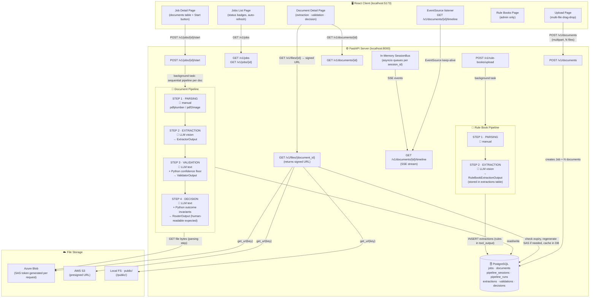
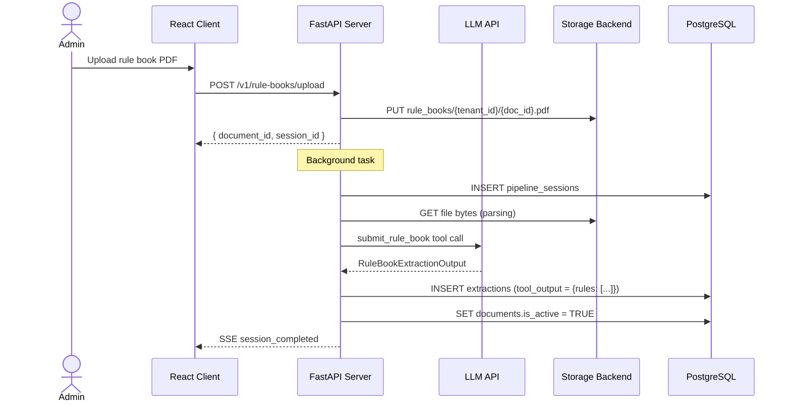
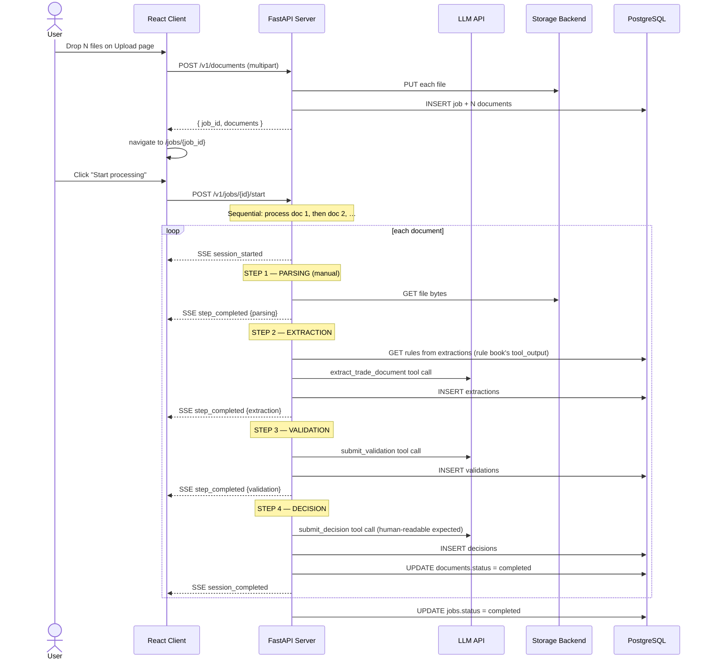

# Nova — Trade Document Pipeline

A multi-agent system that ingests trade documents (Bill of Lading, Commercial Invoice, Packing List, Certificate of Origin), extracts structured fields via a vision LLM, validates them against customer-specific rule books, and routes each document to one of three outcomes: **auto-approve**, **human review**, or **draft amendment**.

---

## Screenshots & Demo

> **📸 Output Screenshots**
> 


--- compliant example ---


 --- non compliant example --- 
 
 

> **🎬 Screen Recording**

https://github.com/user-attachments/assets/8961d117-2702-4aaf-b338-9b39e5313cef

---

## Table of Contents

1. [Quick Start](#quick-start)
2. [Project Structure](#project-structure)
3. [Tech Stack](#tech-stack)
4. [Architecture & Workflow](#architecture--workflow)
5. [Job Entity — Upload Flow](#job-entity--upload-flow)
6. [Agent Design](#agent-design)
7. [Tool Schemas — Input / Output Contracts](#tool-schemas--input--output-contracts)
8. [API Reference](#api-reference)
9. [Database Schema](#database-schema)
10. [Storage Layer & File URLs](#storage-layer--file-urls)
11. [Frontend Pages](#frontend-pages)
12. [Configuration Reference](#configuration-reference)
13. [Engineering Trade-offs](#engineering-trade-offs)
14. [Failure Handling & Safety Guarantees](#failure-handling--safety-guarantees)
15. [Observability](#observability)
16. [Cost Model](#cost-model)
17. [Sample Queries](#sample-queries)

---

## Quick Start

### Prerequisites

| Tool | Version |
|------|---------|
| Python | ≥ 3.11 |
| Node.js | ≥ 18 |
| PostgreSQL | ≥ 14 |
| poppler-utils | any (for `pdf2image`) |

```bash
# Install poppler (Ubuntu/Debian)
sudo apt-get install poppler-utils

# macOS
brew install poppler
```

### 1. Clone & Configure

```bash
git clone <repo-url>
cd trade-document-pipeline
```

### 2. Backend Setup

```bash
cd server
python -m venv .venv
source .venv/bin/activate
pip install -r requirements.txt

cp .env.example .env
# Edit .env — set DATABASE_URL and at minimum one LLM provider key
```

Create the database:

```bash
psql -U postgres -c "CREATE DATABASE nova;"
```

Run migrations (auto-applied on startup, or manually):

```bash
python -c "import asyncio; from app.db.migrate import run_migrations; asyncio.run(run_migrations())"
```

Start the backend:

```bash
uvicorn app.main:app --reload --port 8000
```

### 3. Frontend Setup

```bash
cd client
npm install
npm run dev
```

The frontend dev server runs on `http://localhost:5173` and proxies `/v1` to the backend.

### 4. First Run

1. Open `http://localhost:5173`
2. Sign in — select the **gocomet** tenant, role **admin**
3. Navigate to **Rule Books** → upload a customer rule book PDF (see `samples/`)
4. Navigate to **Upload** → drop one or more trade documents (PDF, image, or DOCX)
5. You land on the **Job** page — review your files and click **Start processing**
6. Watch each document run live in the timeline — extraction → validation → decision
7. Open any document to see per-field confidence, validation table, and routing decision

---

## Project Structure

```
trade-document-pipeline/
├── server/                         # FastAPI backend (Python)
│   ├── app/
│   │   ├── main.py                 # App entrypoint, lifespan hooks
│   │   ├── agents/                 # The four core agents
│   │   │   ├── extractor.py        # Extractor Agent
│   │   │   ├── validator.py        # Validator Agent
│   │   │   ├── router.py           # Router / Decision Agent (humanised expected descriptions)
│   │   │   ├── rule_book_extractor.py  # Rule book parsing agent
│   │   │   └── _schema_helpers.py  # Pydantic → OpenAI strict JSON schema converter
│   │   ├── api/                    # FastAPI route handlers (all prefixed /v1)
│   │   │   ├── auth.py             # /v1/auth — tenant login / session management
│   │   │   ├── documents.py        # /v1/documents — multi-file upload, detail, SSE timeline
│   │   │   ├── jobs.py             # /v1/jobs — job list, detail, start, delete
│   │   │   ├── rule_books.py       # /v1/rule-books — rule book management (admin only)
│   │   │   ├── files.py            # /v1/files — signed URL generation with expiry cache
│   │   │   ├── health.py           # /v1/health
│   │   │   ├── deps.py             # Shared FastAPI dependencies
│   │   │   └── errors.py           # Global error handlers
│   │   ├── services/               # Business logic / orchestration
│   │   │   ├── pipeline.py         # Sequential pipeline: parse→extract→validate→decide
│   │   │   ├── jobs.py             # Job creation, start, sequential document processing
│   │   │   ├── rule_books.py       # Rule book upload orchestration
│   │   │   ├── llm.py              # LLM client wrapper (tool-use enforced)
│   │   │   ├── preprocessing.py    # PDF/image/DOCX → text + base64 images
│   │   │   └── events.py           # In-memory SSE event bus (per session)
│   │   ├── prompts/                # LLM system + user prompt templates
│   │   │   ├── extractor.py
│   │   │   ├── validator.py
│   │   │   ├── router.py           # Instructs LLM to emit human-readable expected descriptions
│   │   │   └── rule_book.py
│   │   ├── schemas/                # Pydantic models — agent I/O contracts
│   │   │   ├── common.py
│   │   │   ├── extraction.py
│   │   │   ├── validation.py
│   │   │   ├── decision.py
│   │   │   ├── rules.py
│   │   │   ├── pipeline.py
│   │   │   └── api.py
│   │   ├── core/
│   │   │   ├── config.py
│   │   │   ├── auth.py
│   │   │   ├── errors.py
│   │   │   ├── logging.py
│   │   │   └── pricing.py
│   │   ├── db/
│   │   │   ├── pool.py
│   │   │   └── migrate.py
│   │   ├── repositories/
│   │   │   ├── documents.py        # CRUD + get_rule_book_rules (reads from extractions table)
│   │   │   ├── jobs.py             # Job CRUD + status rollup
│   │   │   └── tenants.py
│   │   └── storage/
│   │       ├── base.py             # Storage protocol + SignedUrl dataclass
│   │       ├── factory.py
│   │       ├── local.py            # Local FS; get_url() returns /public/<key>
│   │       ├── azure_blob.py       # Azure Blob; get_url() generates SAS token
│   │       └── s3.py               # AWS S3; get_url() generates presigned URL
│   ├── migrations/
│   │   ├── 001_init.sql
│   │   ├── 002_seed_gocoment_tenant.sql
│   │   ├── 003_jobs.sql            # jobs table, documents.job_id, backfill existing docs
│   │   └── 004_file_url_and_drop_extracted_rules.sql  # file_url + drop extracted_rules column
│   ├── requirements.txt
│   └── .env.example
│
├── client/                         # React + TypeScript frontend
│   ├── src/
│   │   ├── App.tsx
│   │   ├── pages/
│   │   │   ├── SignInPage.tsx
│   │   │   ├── JobsListPage.tsx        # Landing page — lists jobs with status
│   │   │   ├── JobDetailPage.tsx       # Job documents table + "Start processing" button
│   │   │   ├── DocumentDetailPage.tsx  # Extraction / validation / decision + timeline
│   │   │   ├── UploadPage.tsx          # Multi-file drag-drop upload
│   │   │   └── RuleBooksPage.tsx
│   │   ├── components/
│   │   │   ├── AppShell.tsx
│   │   │   ├── Timeline.tsx
│   │   │   ├── StatusBadges.tsx
│   │   │   └── ui/
│   │   ├── contexts/
│   │   │   └── AuthContext.tsx
│   │   ├── services/
│   │   │   ├── api.ts              # getFileUrl() fetches signed URL from /v1/files/{id}
│   │   │   └── types.ts
│   │   └── lib/
│   │       └── utils.ts
│   ├── package.json
│   └── vite.config.ts              # Proxies /v1 to :8000
│
└── samples/
    ├── clean_invoice.pdf
    └── messy_bol.jpg
```

---

## Tech Stack

### Backend

| Layer | Choice | Why |
|-------|--------|-----|
| Web framework | **FastAPI** | Async-native, OpenAPI docs built in |
| Database | **PostgreSQL** + AsyncPG | JSONB for agent outputs, strong ACID guarantees |
| LLM | **OpenAI / Azure OpenAI / Gemini** (switchable) | Vision + reasoning; strict tool-use enforces structured output |
| Document parsing | pdfplumber + pdf2image | Native text extraction first; vision fallback for scanned PDFs |
| DOCX support | python-docx | Handles DOCX trade documents |
| Auth | PyJWT | Tenant-level JWT sessions |
| File storage | Local FS / AWS S3 / Azure Blob | Switchable via `STORAGE_BACKEND` env var |
| Schema validation | Pydantic v2 | Strict models with `extra="forbid"` |

### Frontend

| Layer | Choice |
|-------|--------|
| Framework | React 18 |
| Routing | React Router v6 |
| Styling | Tailwind CSS + Radix UI |
| Build | Vite 5 |
| Language | TypeScript 5 |

---

## Architecture & Workflow

### System Architecture



### Rule Book Flow

Rule books follow a **shorter 2-step pipeline** — parsing + LLM extraction only. No validation or decision steps run. Extracted rules are stored in the `extractions` table as `tool_output` JSONB — there is **no `extracted_rules` column** on `documents`.



### Document Pipeline Flow



---

## Job Entity — Upload Flow

A **Job** is the unit of work created each time a user uploads files.

| Property | Detail |
|----------|--------|
| Created | Automatically on `POST /v1/documents` — one Job groups all files in the upload |
| Rule book snapshot | `job.rule_book_id` is set at creation time; the pipeline always uses that version, even if a newer rule book is activated later |
| Initial status | `pending` — pipeline does **not** start automatically |
| Start | User clicks **Start processing** → `POST /v1/jobs/{id}/start` |
| Processing | Documents are processed **sequentially** in the background; per-document errors do not abort the whole job |
| Status rollup | `completed` / `partial_failure` / `failed` is computed from child document statuses |

### Job status transitions

```
pending → processing → completed
                     → partial_failure   (some docs failed, some completed)
                     → failed            (all docs failed)
```

---

## Agent Design

### Why Four Agents?

Separation of concerns across extraction, validation, decision, and rule-book parsing enables:
- Independent retry, swap, and evaluation of each step
- Deterministic Python post-processing layers (confidence floor, outcome invariants) applied per-step
- Per-step DB writes — crash recovery without restarting the whole pipeline
- Cost control: cheapest capable model per step

### 1. Extractor Agent

**File:** [server/app/agents/extractor.py](server/app/agents/extractor.py)

**Model:** Vision LLM (gpt-4o / Azure / Gemini)

**Input:** PreprocessedDocument (text + base64 images)

**Output (ExtractorOutput):**
```json
{
  "doc_type": "bill_of_lading | commercial_invoice | packing_list | certificate_of_origin | unknown",
  "doc_type_confidence": 0.97,
  "fields": {
    "consignee_name": { "value": "ACME CORP LTD", "confidence": 0.97, "source_snippet": "Consignee: ACME CORP LTD" },
    "hs_code":        { "value": "8471.30",        "confidence": 0.91, "source_snippet": "HS: 8471.30" }
  }
}
```

**Post-processing (Python):** `_ensure_all_required_fields` — inserts null stubs for any field the LLM omitted.

---

### 2. Validator Agent

**File:** [server/app/agents/validator.py](server/app/agents/validator.py)

**Model:** Text LLM

**Input:** ExtractorOutput + list of RuleSpec (loaded from `extractions.tool_output` of the rule book document)

**Output (ValidatorOutput):**
```json
{
  "overall_status": "all_match | has_uncertain | has_mismatch",
  "results": {
    "consignee_name": {
      "status": "match | mismatch | uncertain",
      "found": "ACME CORP LTD",
      "expected": "ACME CORP",
      "severity": "critical",
      "reasoning": "Name has extra LTD suffix"
    }
  },
  "summary": "One critical mismatch on consignee_name."
}
```

**Python enforcement (not LLM):**
1. `_enforce_confidence_floor` — any field with `confidence < 0.70` is forced to `uncertain`
2. `_recompute_overall` — `overall_status` recomputed deterministically from the result set

---

### 3. Router / Decision Agent

**File:** [server/app/agents/router.py](server/app/agents/router.py)

**Model:** Text LLM

**Key change — human-readable `expected` field:** The router prompt instructs the LLM to translate raw rule specs into plain English before writing the `expected` field in each discrepancy. Examples:
- `regex "^[A-Z]{3}\d{6,10}$"` → `"three uppercase letters followed by 6–10 digits"`
- `one_of ["FOB","CIF","EXW"]` → `"one of: FOB, CIF, or EXW"`
- `range {min:0, max:100000}` → `"a value between 0 and 100,000"`

**Output (RouterOutput):**
```json
{
  "outcome": "auto_approve | human_review | draft_amendment",
  "reasoning": "Invoice number matches; consignee has a critical name mismatch.",
  "discrepancies": [
    {
      "field": "consignee_name",
      "found": "ACME CORP LTD",
      "expected": "exactly: ACME CORP",
      "severity": "critical",
      "reasoning": "Suffix LTD may cause customs rejection"
    }
  ]
}
```

**Python enforcement:**

| Condition | Forced outcome |
|-----------|---------------|
| Critical mismatch exists | `draft_amendment` |
| Any mismatch or uncertain | `human_review` |
| All match | `auto_approve` |

---

### 4. Rule Book Extractor Agent

**File:** [server/app/agents/rule_book_extractor.py](server/app/agents/rule_book_extractor.py)

**Output stored in:** `extractions.tool_output` as JSONB — **not** a separate `extracted_rules` column. When the document pipeline needs rules, it queries `extractions` for the latest row where `document_id` = rule book id and reads `tool_output.rules`.

```json
{
  "customer_name_in_book": "ACME CORP",
  "rules": [
    { "field_name": "consignee_name", "rule_type": "equals",  "spec": { "value": "ACME CORP" },             "severity": "critical" },
    { "field_name": "incoterms",      "rule_type": "one_of",  "spec": { "values": ["FOB","CIF"] },          "severity": "major" },
    { "field_name": "hs_code",        "rule_type": "regex",   "spec": { "pattern": "^[0-9]{6,10}$" },      "severity": "critical" }
  ]
}
```

---

## Tool Schemas — Input / Output Contracts

All agents use OpenAI function calling with `tool_choice="required"`. Schemas are auto-generated from Pydantic models via `_schema_helpers.openai_strict_schema()` which inlines all `$ref`s and sets `additionalProperties=false` recursively.

### Rule types

| `rule_type` | `spec` shape | Human-readable `expected` example |
|-------------|-------------|----------------------------------|
| `equals` | `{ "value": "ACME CORP" }` | "exactly: ACME CORP" |
| `regex` | `{ "pattern": "^[0-9]{6,10}$" }` | "6 to 10 digit number" |
| `one_of` | `{ "values": ["FOB","CIF","EXW"] }` | "one of: FOB, CIF, or EXW" |
| `required` | `{}` | "must be present and non-empty" |
| `range` | `{ "min": 0, "max": 100000 }` | "a value between 0 and 100,000" |
| `custom` | `{ "description": "free text" }` | verbatim description |

---

## API Reference

All endpoints are prefixed `/v1`. Authentication is a JWT cookie set by `/v1/auth/session`.

### Auth

| Method | Path | Auth | Description |
|--------|------|------|-------------|
| `GET` | `/v1/auth/tenants` | None | List available tenants |
| `POST` | `/v1/auth/session` | None | Sign in — body: `{ tenant_slug, role }` |
| `POST` | `/v1/auth/signout` | Any | Clear session cookie |
| `GET` | `/v1/auth/me` | Any | Current session info |

### Jobs

| Method | Path | Auth | Description |
|--------|------|------|-------------|
| `GET` | `/v1/jobs` | Any | List jobs for tenant (most recent first) |
| `GET` | `/v1/jobs/{id}` | Any | Job detail with document summaries |
| `POST` | `/v1/jobs/{id}/start` | Any | Start pipeline — idempotent; 409 if not pending |
| `DELETE` | `/v1/jobs/{id}` | Any | Soft-delete job + cascade to documents |

### Documents

| Method | Path | Auth | Description |
|--------|------|------|-------------|
| `POST` | `/v1/documents` | Any | Upload N files (multipart). Creates a Job that groups all files. Returns `{ job_id, documents }` |
| `GET` | `/v1/documents/{id}` | Any | Full document detail: extraction, validation, decision, pipeline status |
| `GET` | `/v1/documents/{id}/timeline` | Any | **SSE stream** — live pipeline events |

### Files

| Method | Path | Auth | Description |
|--------|------|------|-------------|
| `GET` | `/v1/files/{document_id}` | Any | Returns `{ url, expires_at }`. Checks DB cache first; regenerates SAS/presigned URL if expired |

### Rule Books

| Method | Path | Auth | Description |
|--------|------|------|-------------|
| `POST` | `/v1/rule-books/upload` | Admin | Upload a rule book PDF; extracts rules and activates |
| `GET` | `/v1/rule-books` | Any | List rule books (metadata only, no rules) |
| `GET` | `/v1/rule-books/{id}` | Any | Rule book detail including extracted rules |

### Health

| Method | Path | Auth | Description |
|--------|------|------|-------------|
| `GET` | `/v1/health` | None | Liveness check |

---

## Database Schema

```
tenants
  id UUID PK | name TEXT | slug TEXT UNIQUE | created_at TIMESTAMPTZ

jobs
  id UUID PK
  tenant_id UUID FK → tenants
  rule_book_id UUID FK → documents   -- snapshot at job creation time
  status TEXT                        -- pending | processing | completed | partial_failure | failed
  document_count INTEGER
  is_active BOOLEAN
  started_at, completed_at, created_at, updated_at TIMESTAMPTZ

documents
  id UUID PK
  tenant_id UUID FK → tenants
  job_id UUID FK → jobs              -- NULL for rule books
  session_id UUID                    -- set when pipeline starts
  type TEXT                          -- 'document' | 'rule_book'
  storage_key TEXT
  original_name TEXT
  mime_type TEXT
  size_bytes BIGINT
  doc_type TEXT                      -- set after extraction
  status TEXT                        -- uploaded → extracting → validating → deciding → completed | failed
  is_active BOOLEAN                  -- rule books: is this the active one for the tenant?
  file_url TEXT                      -- cached signed URL (SAS / presigned / public path)
  file_url_expires_at TIMESTAMPTZ    -- expiry of cached URL; NULL = not yet generated
  created_at, updated_at TIMESTAMPTZ

  NOTE: extracted_rules column has been removed.
        Rule book rules live in extractions.tool_output (JSONB).

pipeline_sessions
  id UUID PK | tenant_id | document_id | type | pipeline_status
  started_at, completed_at | total_tokens_in, total_tokens_out | error_message

pipeline_runs                  -- one row per step per attempt
  id UUID PK | session_id | document_id | step_type | mode | status
  response JSONB | total_tokens_in, total_tokens_out | started_at, completed_at

extractions                    -- stores both doc extractions AND rule book extractions
  id UUID PK | tenant_id | document_id | session_id | pipeline_run_id
  tool_content JSONB           -- raw LLM tool call arguments
  tool_output JSONB            -- post-processed output
                               -- for rule books: tool_output.rules = list of RuleSpec
  created_at TIMESTAMPTZ

validations  (same shape as extractions)
decisions    (same shape as extractions)
```

### Migrations

| File | Description |
|------|-------------|
| `001_init.sql` | Full initial schema |
| `002_seed_gocoment_tenant.sql` | Seed dev tenant |
| `003_jobs.sql` | `jobs` table, `documents.job_id`, backfill existing docs into synthetic jobs |
| `004_file_url_and_drop_extracted_rules.sql` | Add `file_url`/`file_url_expires_at`; drop `extracted_rules` |

---

## Storage Layer & File URLs

### Storage Backends

| `STORAGE_BACKEND` | `get_url()` behaviour | Use case |
|-------------------|-----------------------|----------|
| `local` | Returns `/public/<key>` (served by Vite static in dev) | Development |
| `s3` | Generates a presigned GET URL via `aioboto3`, valid for 1 hour | AWS deployments |
| `azure_blob` | Generates a SAS token URL via `azure.storage.blob.generate_blob_sas`, valid for 1 hour | Azure deployments |

### How file URL caching works

1. Frontend calls `GET /v1/files/{document_id}` (via `getFileUrl()` in `api.ts`).
2. Backend checks `documents.file_url` and `documents.file_url_expires_at`.
3. If the cached URL is still valid (expiry > now + 5 min buffer) → return it immediately.
4. Otherwise → call `storage.get_url(storage_key)` → update `file_url` and `file_url_expires_at` in DB → return new URL.
5. Frontend receives `{ url, expires_at }` and opens the URL in a new tab.

### Local storage (frontend)

When `STORAGE_BACKEND=local`, the file URL points to `/public/<key>`. The Vite dev server serves `client/public/` at the root path. If the file doesn't exist there, the browser will show a 404 — the "View document" button in `DocumentDetailPage` catches this and shows: *"Can't load this file. It may have been moved or is unavailable."*

### Azure private container (SAS tokens)

The Azure container is expected to be **private**. Each access generates a short-lived SAS token signed with the storage account key. The token grants read-only permission on the specific blob for 1 hour. The URL is cached in the DB to avoid generating a new token on every page load.

---

## Frontend Pages

| Page | Route | Description |
|------|-------|-------------|
| Sign In | `/sign-in` | Tenant picker + role selector |
| Jobs List | `/` | Table of jobs with document count, status badge, created date; auto-refreshes every 8s |
| Job Detail | `/jobs/:id` | Documents table with per-doc status; **Start processing** button (only when job is `pending`); polls every 3s while processing |
| Document Detail | `/documents/:id` | Pipeline result: extraction table with confidence, validation table, decision + discrepancies with human-readable expected values; live SSE timeline; "View document" opens signed URL |
| Upload | `/upload` | Multi-file drag-drop; after upload navigates to the new job page |
| Rule Books | `/admin/rule-books` | Upload rule books (admin); list with active badge |

---

## Configuration Reference

| Variable | Required | Default | Description |
|----------|----------|---------|-------------|
| `DATABASE_URL` | Yes | — | PostgreSQL DSN |
| `LLM_PROVIDER` | No | `openai` | `openai` / `azure` / `gemini` |
| `OPENAI_API_KEY` | If openai | — | OpenAI API key |
| `AZURE_OPENAI_API_KEY` | If azure | — | Azure OpenAI key |
| `AZURE_OPENAI_ENDPOINT` | If azure | — | Azure OpenAI endpoint URL |
| `AZURE_OPENAI_API_VERSION` | No | `2024-06-01` | Azure API version |
| `GEMINI_API_KEY` | If gemini | — | Google Gemini key |
| `STORAGE_BACKEND` | No | `local` | `local` / `s3` / `azure_blob` |
| `LOCAL_STORAGE_ROOT` | No | `public` | Root dir for local file storage |
| `S3_BUCKET` | If s3 | — | S3 bucket name |
| `S3_REGION` | If s3 | — | AWS region |
| `AWS_ACCESS_KEY_ID` | If s3 | — | AWS credentials |
| `AWS_SECRET_ACCESS_KEY` | If s3 | — | AWS credentials |
| `AZURE_STORAGE_CONNECTION_STRING` | If azure_blob | — | Full Azure connection string |
| `AZURE_STORAGE_CONTAINER` | If azure_blob | — | Container name (private) |
| `COST_CAP_USD_PER_RUN` | No | `0.50` | Pipeline aborts if cost exceeds this |
| `MAX_RETRIES_PER_NODE` | No | `2` | Tenacity retry limit for LLM failures |
| `LOW_CONFIDENCE_THRESHOLD` | No | `0.70` | Fields below this confidence → forced `uncertain` |
| `MAX_UPLOAD_BYTES` | No | `26214400` (25 MB) | Per-file upload size limit |
| `ALLOWED_ORIGINS` | No | `http://localhost:5173` | CORS origins |
| `JWT_SECRET` | No | `dev-secret-change-me` | **Change in production** |

---

## Engineering Trade-offs

### 1. Job entity as upload bundle

Documents are grouped into a Job at upload time so the user can review files before processing starts. The `rule_book_id` snapshot on the Job ensures pipeline consistency — even if a new rule book is activated while the job is processing, all documents in that job use the same rules.

### 2. Rules stored in extractions, not a dedicated column

`extracted_rules` was a JSONB column on `documents`. It was dropped in migration 004. Rules now live in `extractions.tool_output` — the same table that stores extraction results for trade documents. This eliminates a redundant write path: the rule book pipeline already writes a full extraction row; reading back `tool_output.rules` is a single query with no duplication.

### 3. Router as adaptation agent — human-readable `expected`

The router's `expected` field in discrepancies used to mirror the raw rule spec (e.g. the regex pattern). The prompt now instructs the LLM to translate any regex, range, or `one_of` spec into plain English before writing `expected`. This makes the discrepancy table immediately readable by trade operators without requiring them to interpret regex syntax.

### 4. Signed URLs with DB-level expiry cache

Files are served via `GET /v1/files/{id}` which returns a JSON `{ url, expires_at }` rather than streaming bytes. For Azure (private container) this is a SAS token; for S3 it is a presigned URL; for local dev it is a static path. The URL + expiry are cached in `documents.file_url` / `documents.file_url_expires_at`. On each request the backend checks the cache first (with a 5-minute buffer) and only calls the storage SDK when needed. This avoids unnecessary token generation on every page load.

### 5. Sequential document processing within a job

Documents in a job are processed one at a time (not in parallel). This prevents LLM rate-limit exhaustion on jobs with many documents and makes the SSE timeline readable — you see each document complete before the next starts. The trade-off is latency for large multi-document jobs.

### 6. In-memory SSE bus vs. Redis

The `SessionBus` in `services/events.py` is a dict of asyncio queues keyed by session ID. It is sufficient for a single-process deployment. For horizontal scaling, swap it for a Redis pub/sub adapter behind the same interface.

---

## Failure Handling & Safety Guarantees

### Hallucination prevention

- Absent fields must be `{ value: null, confidence: 0.0, source_snippet: null }` — the schema enforces this.
- `_ensure_all_required_fields` inserts null stubs for any field the LLM omitted.
- Fields below `confidence < 0.70` are forced to `uncertain` in Python regardless of the LLM's judgment.

### Outcome enforcement

- Router outcome is determined **deterministically** from validator signals in Python; the LLM's stated outcome is overridden if it contradicts the signals.
- `auto_approve` is only possible when all fields have `status=match` with no `uncertain` or `mismatch`.

### Job-level isolation

- A per-document error in a job sets that document to `failed` but does not abort the remaining documents.
- Job status rolls up: all completed → `completed`; mix of completed and failed → `partial_failure`; all failed → `failed`.

### Pipeline failure modes

| Failure | Behaviour |
|---------|-----------|
| No active rule book | Pipeline aborts immediately with `no_active_rule_book` before any LLM call |
| Rule book has no extraction record | `get_rule_book_rules` returns `None` → treated as empty rule set |
| Parsing fails | Step marked `fail`; document status → `failed`; session closed |
| LLM transient failure | Tenacity retries up to `MAX_RETRIES_PER_NODE`; on exhaustion, step marked `fail`, pipeline halts |
| LLM returns invalid schema | Pydantic validation fails; pipeline halts; bad output never propagates |
| LLM violates outcome invariant | Python overrides; `[override]` prefix added to reasoning string |
| File URL generation fails | Returns 404 via `NotFoundError`; frontend shows error message |

---

## Observability

### Structured logging

Every log line is JSON tagged with a correlation ID (`sess-{session_id_prefix}`) set at pipeline start.

### SSE timeline events

```
event: session_started       { type: "document" }
event: step_started          { step_type: "extraction", mode: "llm", run_id }
event: step_completed        { step_type: "extraction", status: "success", tokens_in, tokens_out }
event: session_completed     { status: "success", total_tokens_in, total_tokens_out }
```

### Sample queries

**Outcome distribution this week:**
```sql
SELECT d.tool_output ->> 'outcome' AS outcome, COUNT(*)
FROM decisions d
JOIN pipeline_sessions ps ON ps.id = d.session_id
WHERE ps.started_at >= NOW() - INTERVAL '7 days'
GROUP BY outcome;
```

**All router overrides (Python corrected the LLM):**
```sql
SELECT doc.original_name, d.tool_output ->> 'reasoning'
FROM decisions d
JOIN documents doc ON doc.id = d.document_id
WHERE d.tool_output ->> 'reasoning' LIKE '[override]%';
```

**Rule book rules for a given document:**
```sql
SELECT e.tool_output -> 'rules'
FROM extractions e
JOIN documents d ON d.id = e.document_id
WHERE d.type = 'rule_book' AND d.is_active = TRUE
ORDER BY e.created_at DESC LIMIT 1;
```

**Documents with expired file URL cache:**
```sql
SELECT id, original_name, file_url_expires_at
FROM documents
WHERE file_url IS NOT NULL
  AND file_url_expires_at < NOW();
```

---

## Cost Model

Back-of-envelope per document (gpt-4o pricing):

| Step | Tokens in | Tokens out | Cost (approx.) |
|------|-----------|-----------|----------------|
| Extraction (vision) | ~1,200 | ~400 | ~$0.016 |
| Validation (text) | ~800 | ~600 | ~$0.014 |
| Decision (text) | ~600 | ~300 | ~$0.009 |
| **Total per document** | **~2,600** | **~1,300** | **~$0.04** |

Cost controls: `COST_CAP_USD_PER_RUN=0.50`, `max_tokens` per call, `MAX_RETRIES_PER_NODE=2`.
